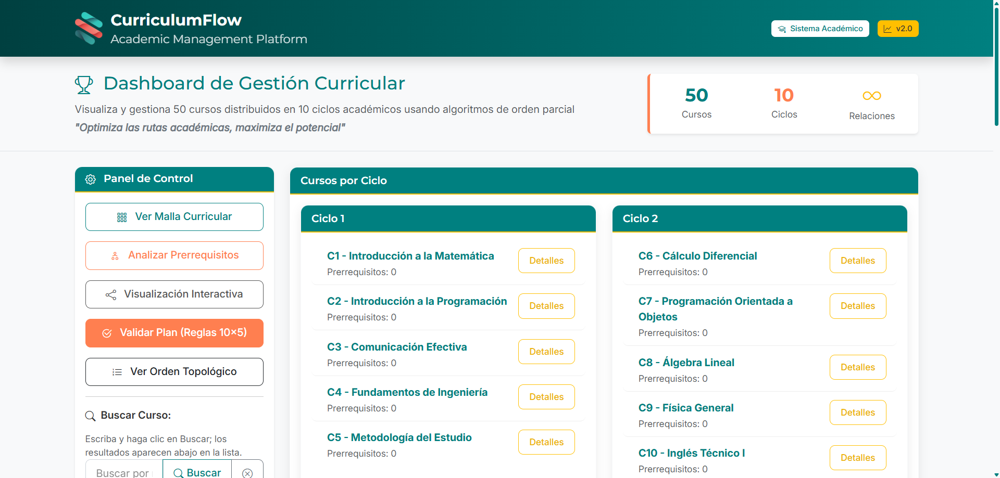
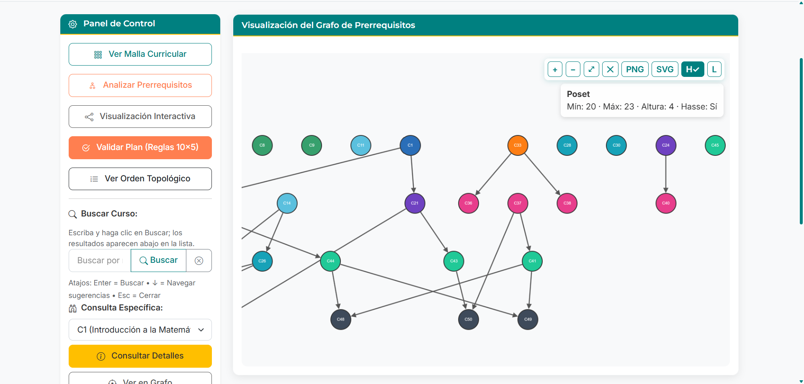
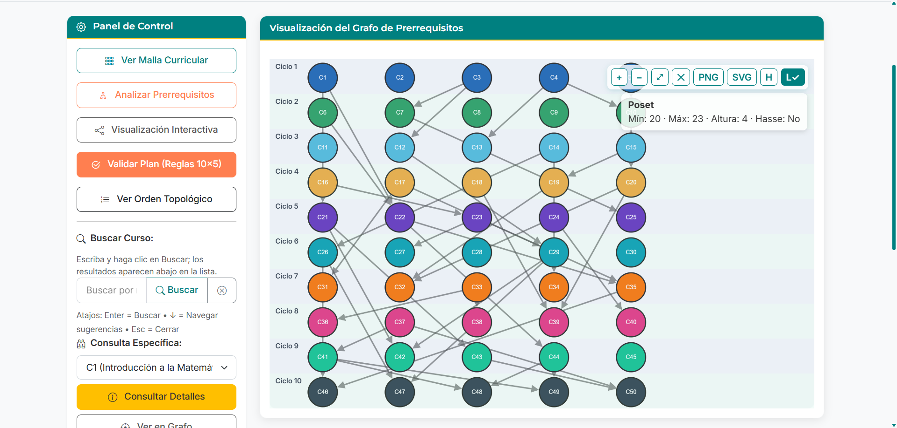
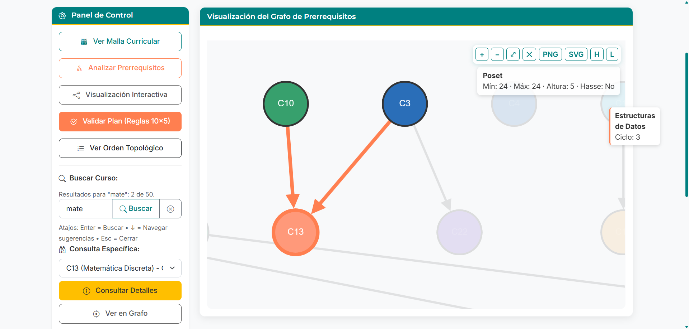
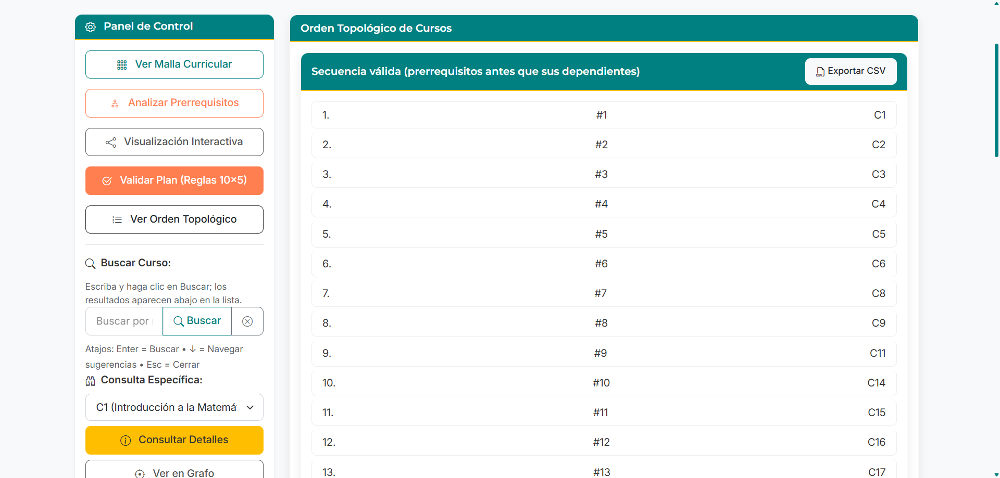
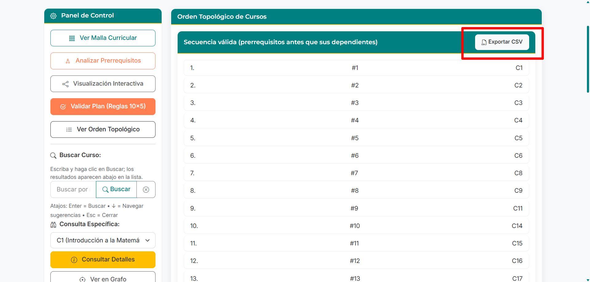
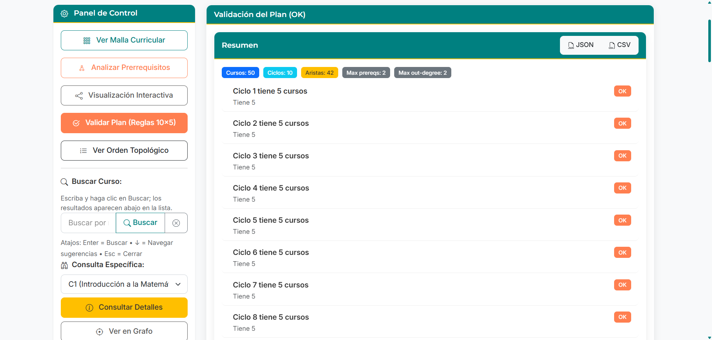
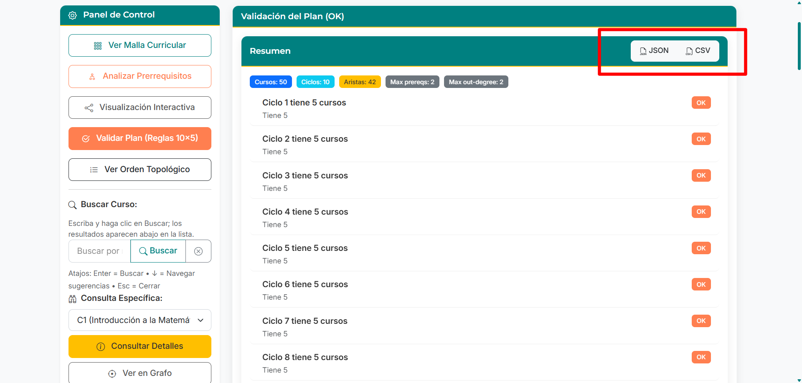
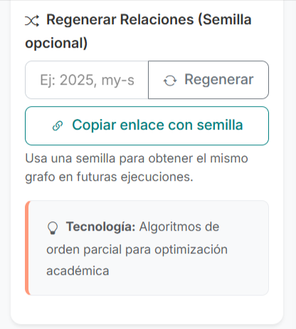

#  CurriculumFLOW

## Optimiza las rutas académicas, maximiza el potencial

CurriculumFlow es una aplicación web diseñada para instituciones educativas que necesitan gestionar, visualizar y optimizar planes de estudio considerando relaciones de prerrequisitos entre cursos.

[](LICENSE)

[](https://trinity-bytes.github.io/CurriculumFLOW/)

## 📑 Índice

- [Descripción](#descripción)
- [Características principales](#características-principales)
- [Tecnologías utilizadas](#tecnologías-utilizadas)
- [Instalación](#instalación)
- [Uso](#uso)
- [Demo en vivo (GitHub Pages)](#demo-en-vivo-github-pages)
- [Reproducibilidad con semilla y enlaces compartibles](#reproducibilidad-con-semilla-y-enlaces-compartibles)
- [Orden topológico (valor agregado)](#orden-topológico-valor-agregado)
- [Exportar datos](#exportar-datos)
- [Atajos y navegación rápida](#atajos-y-navegación-rápida)
- [Accesibilidad (A11y)](#accesibilidad-a11y)
- [Despliegue en GitHub Pages](#despliegue-en-github-pages)
- [Desarrollo local rápido (opcional)](#desarrollo-local-rápido-opcional)
- [Problemas comunes](#problemas-comunes)
- [Lanzamiento (releases)](#lanzamiento-releases)
- [Changelog (resumen v2.0)](#changelog-resumen-v20)
- [Reglas del sistema](#reglas-del-sistema)
- [Estructura del proyecto](#estructura-del-proyecto)
- [Algoritmos implementados](#algoritmos-implementados)
- [Licencia](#licencia)

## 📋 Descripción

CurriculumFlow implementa algoritmos de ordenamiento topológico basados en relaciones de orden parcial para distribuir automáticamente cursos académicos en ciclos universitarios. La aplicación permite a los administradores académicos:

- Visualizar gráficamente dependencias entre cursos
- Detectar posibles conflictos o ciclos en prerrequisitos
- Optimizar la distribución de cursos en ciclos académicos
- Simular escenarios de modificación curricular

Este proyecto nace como solución al problema de organización de mallas curriculares complejas donde las relaciones de prerrequisitos determinan el flujo óptimo de aprendizaje.

## ✨ Características principales

- **Visualización interactiva** de cursos y sus prerrequisitos
- **Generación automática** de prerrequisitos con restricciones configurables
- **Ordenamiento topológico** para asignar cursos a ciclos académicos
- **Validación de consistencia** para detectar ciclos o conflictos
- **Interfaz intuitiva** para consulta de información de cursos
- **Diseño responsivo** que funciona en diferentes dispositivos
- **Totalmente funcional offline** gracias a la localización de todas las dependencias (CSS, JS, fuentes).

## 🔧 Tecnologías utilizadas

- **Frontend**: HTML5, CSS3, JavaScript (ES6+)
- **Frameworks y Bibliotecas**:
  - **Bootstrap 5**: Para la estructura y estilos base de la interfaz de usuario.
  - **Bootstrap Icons**: Para la iconografía de la aplicación.
  - **Cytoscape.js**: Para la visualización interactiva de grafos de cursos y prerrequisitos.
  - **Dagre.js**: Como layout para Cytoscape.js, para organizar automáticamente los nodos del grafo.
- **Fuentes**:
  - **Google Fonts (Inter y Montserrat)**: Descargadas y servidas localmente para asegurar la disponibilidad offline y consistencia visual.
- **Control de versiones**: Git
- **Entorno de desarrollo**: Visual Studio Code

## 📥 Instalación

Todas las dependencias necesarias (Bootstrap, Bootstrap Icons, Cytoscape.js, Dagre.js, y fuentes) están incluidas localmente en el repositorio. No se requiere un proceso de instalación de paquetes externos.

1. Clona el repositorio:

```sh
git clone https://github.com/trinity-bytes/CurriculumFLOW.git
```

2. Navega al directorio del proyecto:

```sh
cd CurriculumFLOW
```

3. Abre `index.html` en tu navegador. Se recomienda utilizar un servidor local (como la extensión "Live Server" en VS Code) para un mejor rendimiento y para evitar posibles problemas con las rutas de archivos al cargar módulos JS o recursos.

## 🚀 Uso

1. **Página principal**: Muestra la distribución actual de cursos por ciclo.
2. **Ver prerrequisitos**: Permite visualizar las relaciones de prerrequisitos entre cursos.
3. **Consultar curso**: Busca información específica de un curso incluyendo sus prerrequisitos y los cursos que lo tienen como prerrequisito.

## 🌐 Demo en vivo (GitHub Pages)

La aplicación está publicada en GitHub Pages. Accede con una URL del tipo:

```
https://trinity-bytes.github.io/CurriculumFLOW/
```


### 🔁 Reproducibilidad con semilla y enlaces compartibles

Para generar siempre el mismo grafo de prerrequisitos puedes usar una semilla:

- En la UI, escribe una semilla en el campo “Regenerar Relaciones (Semilla opcional)” y pulsa “Regenerar”.
- Pulsa “Copiar enlace con semilla” para obtener una URL que podrás compartir; al abrirla, la app cargará esa misma semilla automáticamente.

También puedes construir la URL manualmente añadiendo `?seed=TU_SEMILLA` al final, por ejemplo:

```
file:///ruta/a/CurriculumFLOW/index.html?seed=2025
```

o en un despliegue web:

```
https://tusitio/curriculumflow/?seed=2025
```

Notas:
- La semilla controla únicamente la generación aleatoria de relaciones; los 10 ciclos con 5 cursos cada uno se mantienen fijos.
- Si no proporcionas semilla, se usará una aleatoria (no reproducible).

### 🧭 Orden topológico (valor agregado)

El orden topológico (OT) es una linealización de un grafo acíclico donde cada curso aparece después de todos sus prerrequisitos. En CurriculumFlow sirve para:

- Verificar consistencia: si no aparecen los 50 cursos, existe un ciclo en los prerrequisitos.
- Obtener una secuencia válida de cursado que respeta todas las dependencias.
- Base para métricas del poset: altura (cadena más larga), mínimos/máximos y estimar ancho.
- Nivelación visual: facilita agrupar por “carriles” o niveles en el grafo.
- Análisis rápido: cursos muy tardíos suelen arrastrar muchos prerequisitos; los tempranos tienen pocos o ninguno.

Cómo verlo en la app: en el Panel de Control, haz clic en “Ver Orden Topológico”. La lista resultante muestra una secuencia válida (prerrequisitos antes que sus dependientes). Si usas una semilla, el OT será reproducible entre ejecuciones.

## ⬇️ Exportar datos

La app permite exportar resultados clave para análisis externo:

- Orden Topológico → CSV: incluye columnas `orden,id,nombre,ciclo`.
- Validación del Plan → JSON y CSV: objeto completo (JSON) y resumen con métricas y checks (CSV).

Ubicación de los botones:

- En “Ver Orden Topológico”, botón “Exportar CSV” en la cabecera.
- En “Validar Plan (Reglas 10×5)”, botones “JSON” y “CSV” en la cabecera del resumen.

Notas:

- Los archivos se descargan directamente desde el navegador (no se requiere backend).
- En navegadores con pop-ups restringidos, asegúrate de permitir descargas iniciadas por el sitio.

## ⌨️ Atajos y navegación rápida

- Buscador de cursos:
  - Enter: Buscar
  - Flecha abajo (↓): Enfocar sugerencias
  - Escape (Esc): Cerrar sugerencias / limpiar
- Grafo de prerrequisitos (toolbar):
  - Flechas/HOME/END: Mover el foco entre botones
  - “H”: Alternar diagrama de Hasse (reducción transitiva)
  - “L”: Alternar carriles de ciclos
  - Botón “✕”: Limpiar resaltado

| Vista inicial | Buscador con sugerencias |
| --- | --- |
|  |  |

| Grafo con Hasse | Carriles por ciclo |
| --- | --- |
|  |  |

| Ver en Grafo |
| --- |
|  |

| Orden Topológico | Export OT CSV |
| --- | --- |
|  |  |

| Validación del plan | Export Validación |
| --- | --- |
|  |  |

| Copiar enlace con semilla |
| --- |
|  |

## ♿ Accesibilidad (A11y)

Mejoras aplicadas para navegabilidad con teclado y lectores de pantalla:

- Toolbar del grafo con `role="toolbar"` y `aria-label`; toggles con `aria-pressed`.
- Focus visible de alto contraste en botones del grafo.
- Métricas con `role="status"` y `aria-live="polite"` (anuncia cambios como estado Hasse).
- Tooltip con `role="tooltip"`.
- Buscador con `aria-describedby` (feedback + atajos) y gestión de `aria-expanded` en sugerencias.
- Modal de curso con foco inicial en el título y retorno del foco al disparador al cerrar.

## 🚀 Despliegue en GitHub Pages

Pasos sugeridos (rama principal):

1. En GitHub, ve a Settings → Pages.
2. En “Build and deployment”, elige “Deploy from a branch”.
3. Selecciona la rama `main` (o `master`) y la carpeta raíz.
4. Guarda y espera a que se publique. La URL será: `https://<usuario>.github.io/<repo>/`.
5. Verifica el sitio: https://trinity-bytes.github.io/CurriculumFLOW/

## 🧰 Desarrollo local rápido (opcional)

Windows (PowerShell):

Opciones (elige una):

- Extensión “Live Server” en VS Code (recomendado para HTML estático).
- Servidor estático con Node.js (npx):

```powershell
npx serve .
```

- Servidor simple con Python 3:

```powershell
py -m http.server 8080
```

Luego abre `http://localhost:8080` y navega a `index.html`.

## ❗ Problemas comunes

- “No carga un icono/fuente en Pages”: verifica el nombre del archivo y su mayúscula/minúscula.
- “El enlace copiado no funciona”: asegúrate de que incluye `?seed=...` si esperas reproducibilidad; revisa que el dominio sea el de Pages.
- “Atajos no parecen funcionar”: confirma que el foco esté en el campo de búsqueda o en la toolbar del grafo.

## 🚀 Lanzamiento (releases)

Checklist para publicar una versión en GitHub:

1. Actualiza capturas si hubo cambios visuales (carpeta `assets/screenshots/`).
2. Verifica el sitio en Pages: https://trinity-bytes.github.io/CurriculumFLOW/
3. Confirma que los botones de exportación descargan archivos correctamente.
4. Revisa accesibilidad básica: tabulación por la toolbar, modal con foco inicial/retorno.
5. Crea un tag: `v2.0` y redacta el Release Notes con highlights (puedes basarte en `CHANGELOG.md`).
6. En la descripción del repo, añade el enlace a la demo.

Changelog completo: ver [CHANGELOG.md](CHANGELOG.md).

## 📝 Changelog (resumen v2.0)

- Orden topológico (Kahn) con vista dedicada y exportación CSV.
- Toggle de diagrama de Hasse (reducción transitiva) y métricas del poset.
- Carriles por ciclo con alineación de nodos por ciclo.
- Buscador mejorado: botones Buscar/Limpiar, sugerencias con resaltado, ARIA y atajos.
- “Ver en Grafo” desde selección; foco y resaltado del curso.
- Exportaciones: validación (JSON/CSV) y orden topológico (CSV).
- Accesibilidad: roles/ARIA, focus visible, modal con manejo de foco.

## 📜 Reglas del sistema

El sistema opera bajo las siguientes reglas de negocio:

- Existen 50 cursos obligatorios distribuidos en 10 ciclos (5 cursos por ciclo)
- Los cursos C1-C5 (primer ciclo) no tienen prerrequisitos
- Los cursos C46-C50 (décimo ciclo) no son prerrequisitos de ningún otro curso
- Cada curso puede tener 0, 1 o 2 prerrequisitos
- No se consideran auto-prerrequisitos (no hay bucles)
- Conceptualmente es una relación de orden parcial; en la app se modela como un DAG

## 📂 Estructura del proyecto

```
/CurriculumFLOW
├── css/
│   ├── bootstrap/
│   │   └── bootstrap.min.css         # Bootstrap 5 CSS
│   ├── bootstrap-icons/
│   │   ├── bootstrap-icons.css       # Bootstrap Icons CSS
│   │   └── fonts/                    # Archivos de fuentes de Bootstrap Icons (.woff, .woff2)
│   ├── main.css                      # Estilos personalizados principales
│   └── Graph.css                     # Estilos para la visualización del grafo
├── js/
│   ├── lib/
│   │   ├── bootstrap/
│   │   │   └── bootstrap.bundle.min.js # Bootstrap 5 JS Bundle
│   │   ├── cytoscape.min.js            # Cytoscape.js (core)
│   │   ├── dagre/
│   │   │   └── dagre.min.js            # Dagre (para layout de Cytoscape)
│   │   └── cytoscape-dagre/
│   │       └── cytoscape-dagre.js      # Adaptador de Cytoscape para Dagre
│   ├── models/
│   │   ├── Curso.js
│   │   └── Curriculum.js
│   ├── controllers/
│   │   └── AppController.js
│   ├── views/
│   │   ├── CursoView.js
│   │   └── GraphView.js
│   └── main.js                       # Script principal de la aplicación
├── assets/
│   ├── imgs/                         # Logos e imágenes de la aplicación
│   └── fonts/                        # Fuentes personalizadas (Inter, Montserrat)
│       ├── local-google-fonts.css    # CSS para cargar fuentes locales
│       ├── Inter_*.ttf
│       └── Montserrat_*.ttf
├── index.html                        # Página principal de la aplicación
├── README.md                         # Este archivo
└── LICENSE                           # Licencia del proyecto
```

## 🧮 Algoritmos implementados

### Generación de prerrequisitos (con semilla)

- Generación reproducible con PRNG basada en semilla.
- Respeta reglas: 10×5, ≤2 prerrequisitos por curso, sin ciclos.
- Implementación en `js/models/Curriculum.js` → `generarRequisitos(seed)`.

### Ordenamiento topológico (Kahn)

- Usamos el algoritmo de Kahn para obtener un OT determinista y detectar ciclos.
- Implementación en `Curriculum.ordenarCursosTopologicamente()`.

### Reducción transitiva (diagrama de Hasse)

- Eliminación de aristas cubiertas por caminos alternos para visualizar la relación de cobertura.
- Implementación en `Curriculum.hasseAristas()`; métricas del poset en `calcularMetricasPoset()`.

## 📄 Licencia

Este proyecto está bajo la Licencia MIT - ver el archivo [LICENSE](LICENSE) para más detalles.

---

© 2025 CurriculumFlow - Desarrollado como proyecto educativo para demostrar aplicaciones prácticas de algoritmos de ordenamiento topológico.
